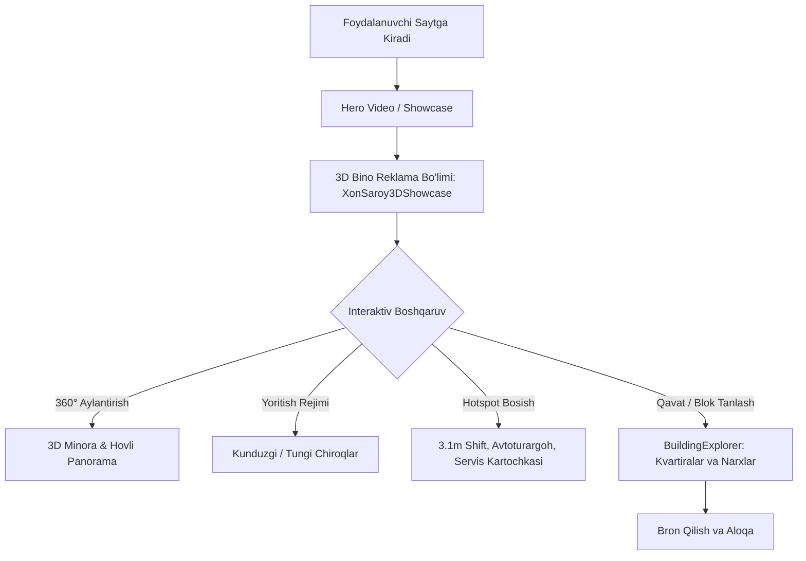

# Plan: Xon Saroy — Binolarni 3D Ko'rish va Reklama Showcase Tizimi

**Loyiha**: Xon Saroy — Orzular turar-joy majmuasi
**Murakkablik**: Medium (O'rta)

## Xulosa (Summary)
Ushbu reja **Xon Saroy — Orzular** turar-joy majmuasining ko'p qavatli binolarini real vaqt rejimida 3D ko'rish, 360° interaktiv aylantirish, me'moriy afzalliklar va reklamalarni (hotspotlar) ko'rsatish, hamda foydalanuvchini to'g'ridan-to'g'ri kvartiralar rejasiga ([BuildingExplorer](file:///d:/projects/home/src/components/BuildingExplorer.tsx)) yo'naltirish imkoniyatini taqdim etadi.

## O'zgartiriladigan va Yangi Yaratiladigan Fayllar
| Fayl | Amaliyot | Sabab |
|---|---|---|
| `src/components/XonSaroy3DShowcase.tsx` | CREATE | Xon Saroy uchun boyitilgan 3D reklama canvas va interaktiv boshqaruv komponenti |
| `src/components/XonSaroy3DShowcase.test.tsx` | CREATE | 3D bo'limining interfeys va boshqaruv testlari |
| `src/app/page.tsx` | UPDATE | Yangi 3D reklama bo'limini bosh sahifaga integratsiya qilish |
| `src/components/Navbar.tsx` | UPDATE | 3D Reklama bo'limi uchun silliq navigatsiya |

## Bosqichlar va Vazifalar (Tasks)

### 1-vazifa: 3D Bino Me'moriy Modeli
- **Harakat**: `@react-three/fiber` va `@react-three/drei` yordamida Xon Saroy minoralarining 3D modelini, bronza vitraj oynalarini, tomdagi terassalarni va yashil hovlisini yaratish.
- **Tekshirish**: Model render bo'lishi va OrbitControls orqali silliq aylanishi.

### 2-vazifa: Interaktiv Reklama Hotspotlari (Floating HTML Pins)
- **Harakat**: Model atrofida `drei/Html` orqali quyidagi reklama afzalliklarini suzuvchi marker sifatida ko'rsatish:
  - 🌟 Shift balandligi: 3.1 metr
  - 🚗 2 qavatli yer osti avtoturargoh
  - 🛡️ 24/7 Muhtasham Saroy Servis tizimi
  - ⚽ Xavfsiz eko-hovli va futbol maydoni
  - 💳 18–36 oygacha foizsiz muddatli to'lov (rassrochka)
- **Tekshirish**: Marker bosilganda reklama tafsilotlari kartasi ochilishi.

### 3-vazifa: Kunduzgi va Tungi Me'moriy Yoritish
- **Harakat**: Kunduzgi tabiiy quyosh va tungi me'moriy chiroqlar (DirectionalLight, AmbientLight, Spotlight va PointLight) o'rtasida rejim almashtirish tugmasi.
- **Tekshirish**: Chiroqlar tugmasi bosilganda sahna atmosferasi va materiallar moslashishi.

### 4-vazifa: Kvartiralar Rejasi bilan Bog'lash
- **Harakat**: 3D modeldagi blok/qavat tanlanganda to'g'ridan-to'g'ri `BuildingExplorer` bo'limidagi mos qavatga silliq o'tish (`#apartments`).
- **Tekshirish**: Foydalanuvchi tanlagan qavat pastki jadvalda avtomatik faollashishi.

### 5-vazifa: Vitest Testlari va 80%+ Coverage
- **Harakat**: Komponent uchun to'liq unit testlar yozish va umumiy coverage ko'rsatkichini 80%+ darajada saqlash.
- **Tekshirish**: `npm test` va `npx vitest run --coverage` barcha testlardan 100% muvaffaqiyatli o'tishi.

## Xatarlar va Ularni Oldini Olish (Risks & Mitigation)
| Xavf | Ehtimollik | Yechim |
|---|---|---|
| Mobil qurilmalarda WebGL og'irligi | O'rta | Shadow maplarni o'chirish, `dpr={[1, 1.5]}` va engil polygonli geometriya |
| Touch skroll to'siqlari | O'rta | Canvas touch-action boshqaruvini to'g'ri sozlash |
| jsdom da WebGL ishlamasligi | Yuqori | Testlarda Canvas va Three.js elementlarini xavfsiz mock qilish |

## Qabul Qilish Mezonlari (Acceptance Criteria)
- [ ] Barcha 5 ta vazifa to'liq amalga oshirilgan
- [ ] 3D interaktiv bino aylanadi, yaqinlashadi va yoritish rejimlari ishlaydi
- [ ] Reklama hotspotlari bosilganda ma'lumotlar ko'rinadi
- [ ] BuildingExplorer bilan bog'lanish ishlaydi
- [ ] Vitest testlari 100% o'tadi va coverage 80%+ darajada bo'ladi
