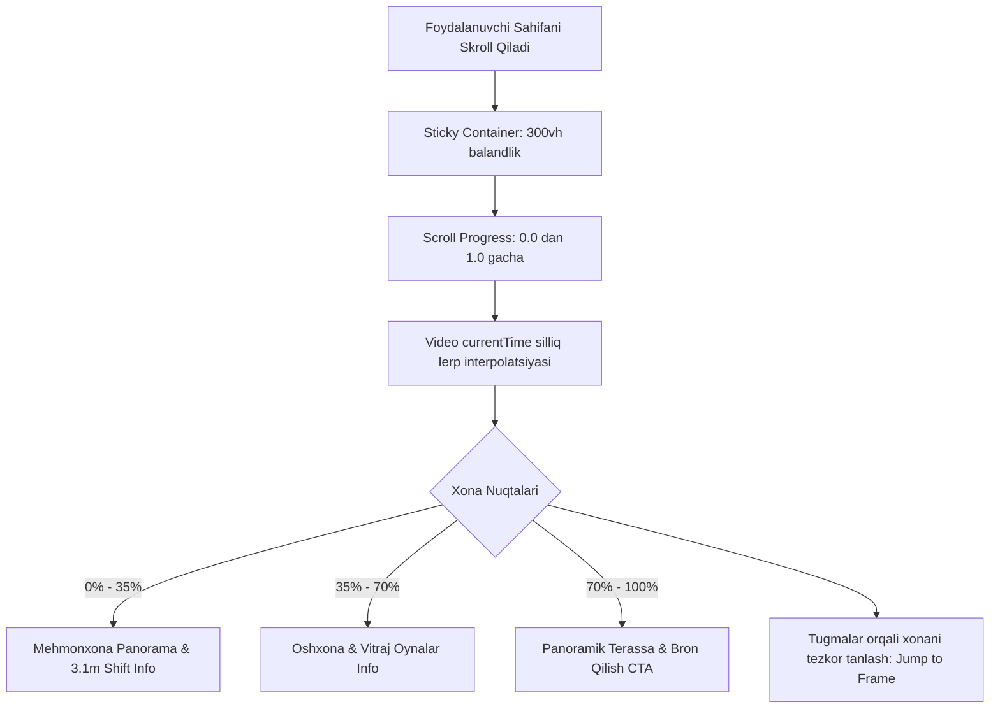

# Plan: Xon Saroy — Virtual 360° Xonadonlar Turi (Scroll-Driven 3D Video Tour)

**Source PRD**: [.claude/prds/xon-saroy-vr-tour.prd.md](file:///d:/projects/home/.claude/prds/xon-saroy-vr-tour.prd.md)
**Selected Milestone**: Milestone 1 & 2: Scroll-Driven 3D Tour Player va Interaktiv Xona Hotspotlari
**Complexity**: Medium

## Summary
Ushbu reja foydalanuvchining sahifani skroll qilishiga bog'langan holda xonadon ichini 3D formatda aylanib ko'rsatuvchi video-scrubbing (frame-by-frame silliq boshqaruv) tizimini joriy etadi. Foydalanuvchi skroll qilganda kamera xonalar bo'ylab silliq harakatlanadi, maxsus xona nazorat nuqtalari (Mehmonxona, Oshxona, Panoramik terassa) faollashadi, har bir xonaning afzalliklari (3.1m shift, akustik oyna) infokartochka sifatida ko'rsatiladi va to'g'ridan-to'g'ri bron qilish CTA tugmasi taqdim etiladi.



## Patterns to Mirror
| Category | Source | Pattern |
|---|---|---|
| Naming | [src/components/XonSaroy3DShowcase.tsx:35](file:///d:/projects/home/src/components/XonSaroy3DShowcase.tsx#L35) | Konstantalar (`XON_SAROY_HOTSPOTS`), TypeScript interfeyslari (`interface RoomCheckpoint`), export default component |
| Error Handling | [src/components/HeroSection.tsx:500](file:///d:/projects/home/src/components/HeroSection.tsx#L500) | Video metadata load tekshiruvi, `isFinite(duration)` va fallback poster |
| Tests | [src/components/XonSaroy3DShowcase.test.tsx:22](file:///d:/projects/home/src/components/XonSaroy3DShowcase.test.tsx#L22) | Vitest, userEvent, test-id va role orqali tugmalarni boshqarish, coverage 80%+ |

## Files to Change
| File | Action | Why |
|---|---|---|
| `src/components/XonSaroyVRTour.tsx` | CREATE | Skrollga bog'langan 3D xonadon video-scrubbing pleyeri, xonalar boshqaruv paneli va axborot kartochkalari |
| `src/components/XonSaroyVRTour.test.tsx` | CREATE | Komponentning skroll, xona tanlash, infokartochkalar va CTA tugmalari unit testlari |
| `src/app/page.tsx` | UPDATE | Yangi `XonSaroyVRTour` bo'limini bosh sahifaga integratsiya qilish |
| `src/components/Navbar.tsx` | UPDATE | Navigatsiyaga `VR Tur` yoki `Xonadonlar Turi` silliq havolasini ulash |
| `src/app/page.test.tsx` | UPDATE | Yangi bo'lim sahifada render bo'lishini tasdiqlovchi testni yangilash |

## Tasks

### Task 1: Scroll-Driven Video Scrubbing Player
- **Action**: `XonSaroyVRTour.tsx` komponentini yaratish. Foydalanuvchi sahifani skroll qilganda konteynerning `scrollYProgress` qiymatini olib, videoning `currentTime` parametrini silliq yangilash (`lerp` yoki `requestAnimationFrame` orqali).
- **Video manbasi**: Mavjud `public/videos/professional_qilb_ber_shuni_ma.mp4` va `public/videos/palisades-showcase.mp4`.
- **Mirror**: [HeroSection.tsx](file:///d:/projects/home/src/components/HeroSection.tsx) video boshqaruvi va [ScrollReveal.tsx](file:///d:/projects/home/src/components/ScrollReveal.tsx) animatsiya strukturalari.
- **Validate**: Video skroll qilinganda vaqt progressi silliq o'zgarishi, video metadata yuklanishi va yuklanish indikatori ko'rsatilishi.

### Task 2: Interaktiv Xonalar Nuqtalari (Room Checkpoints)
- **Action**: Videoda 3 ta asosiy fazani belgilash:
  1. **Mehmonxona (Living Room)**: 0.0 – 0.35 vaqt oralig'i (3.1m baland shift, maydon 42 m²)
  2. **Zamonaviy Oshxona (Kitchen & Dining)**: 0.35 – 0.70 vaqt oralig'i (Germaniya furniturasi, tosh stoleshnitsa)
  3. **Panoramik Yotoqxona / Terassa**: 0.70 – 1.00 vaqt oralig'i (Shahar manzarasi, shinam dam olish zonasi)
- **Boshqaruv**: Foydalanuvchi yuqoridagi tugmalardan birini bosganda videoni o'sha vaqtga silliq o'tkazish (`seekToTime`).
- **Validate**: Xona tugmasi bosilganda tegishli infokartochka va xona nomi aktivlashishi.

### Task 3: Xonadon Xususiyatlari va Bron Qilish CTA
- **Action**: Ekranning pastki o'ng yoki chap burchagida hozirgi xonaning o'lchamlari va afzalliklari kartochkasini chiqarish. "Ushbu xonadonni bron qilish" tugmasi orqali `#contact` yoki `#apartments` bo'limiga yo'naltirish.
- **Validate**: CTA bosilganda `#contact` formasi ochilishi yoki skroll bo'lishi.

### Task 4: Unit Testlar va 80%+ Test Qamrovi
- **Action**: `src/components/XonSaroyVRTour.test.tsx` faylini yozish.
  - Video rendering va boshlang'ich holatni tekshirish
  - Xonalar bo'ylab o'tish tugmalari (`userEvent.click`)
  - Kartochka ma'lumotlari to'g'ri ko'rinishi
  - CTA havolasi mavjudligi
- **Validate**: `npx vitest run src/components/XonSaroyVRTour.test.tsx` va umumiy `npx vitest run --coverage` 80%+ saqlanishi.

## Validation
```bash
npx vitest run src/components/XonSaroyVRTour.test.tsx
npx vitest run --coverage
npm run build
```

## Risks
| Risk | Likelihood | Mitigation |
|---|---|---|
| Safari / iOS qurilmalarda video `currentTime` o'zgarishi paytida titrash (stutter) | O'rta | `playsInline`, `muted` atributlari va `preload="auto"` sozlash, vaqt o'zgarishini `Math.abs(diff) > 0.05` sharti bilan cheklash |
| Test muhitida (jsdom) `HTMLMediaElement.duration` nol yoki `NaN` bo'lishi | Past | `vitest.setup.ts` da mock mavjud, testlarda mock duration belgilash |

## Acceptance
- [ ] Xon Saroy uchun skrollga bog'langan 3D xonadon sayri yaratilgan
- [ ] Xonalar bo'yicha tezkor o'tish tugmalari (Mehmonxona, Oshxona, Terassa) ishlaydi
- [ ] Xona ma'lumotlari (shift, maydon, qulayliklar) interaktiv ko'rsatiladi
- [ ] Barcha yangi va mavjud testlar (22 ta test fayli) 100% muvaffaqiyatli o'tadi
- [ ] Test qamrovi (coverage) 80%+ darajada qoladi
